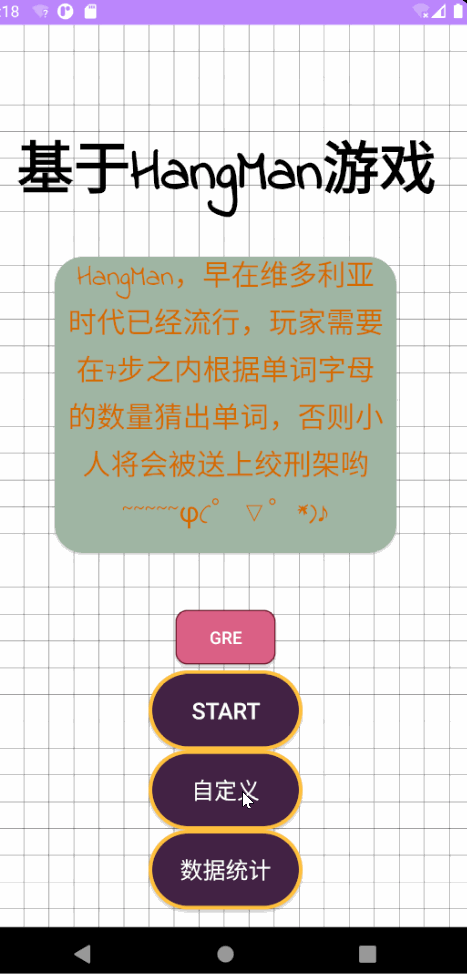

# Hangman Game Word

## TO DO

### 不加数据库之前：

* 选择单词本并且加载
* 根据单词本生成随机数
* 去掉已经选过的单词
* 积分系统

### 加了数据库之后：

用户信息表：

| ID   | 账户 | 密码 |
| :--- | ---- | ---- |

用户单词记录表：

| ID   | 单词 | 日期 | 单词目录|
| ---- | ---- | ---- |----|

用户分数表：

| ID   | 总分 | 段位 |
| ---- | ---- | ---- |
|      |      |      |

* 将单词记忆结果记录到数据库里面

* 根据数据库的结果和`robinhood`生成图表

  

This repository represents Hang Man game written in java by android studio

## 遇到的问题记录：

### API:

* 首先是API的解析，这点非常令人头疼，因为每一个网站的API格式基本都不一样，必须清晰的了解到他的API格式才能解析成功

* 我使用的[Treasure API](https://www.dictionaryapi.com/products/index)，有的时候是没有全部信息的，没有反义词/近义词，这时候就需要分组讨论，进行解决

  > 我的解决办法是，判断API获得的String的长度，如果count小于1000，就把他视为非常规的情况，另作处理

## 目前截图

